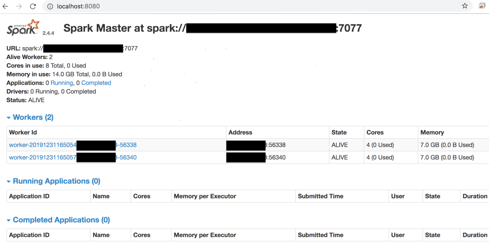
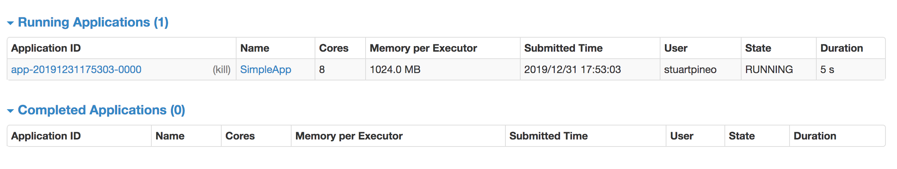

# SparkApp

Test application using PySpark (Python) that outputs alphabet characters counts from scanning a file

## Run using the _PySpark_ library (Amazon Linux)

The below steps show the installation in an AWS _Amazon Linux_ instance

### 1. If needed, install Python (2 or 3) as _root_ user (version 3 being the preferred option)

### 2. Set up the _pip_ installer and install the library (root)

```
curl -O https://bootstrap.pypa.io/get-pip.py
python3 get-pip.py --user
export PATH=$PATH:~/.local/bin (or, on Mac OS add this path to /etc/paths, make sure you also add the other paths)
pip install pyspark --user
```

You may need to run it using python (i.e., python 2.7, no longer supported as of 2020) and/or python3 (python 3.7) which is recommended

### 3. Run the application:

```
./SparkApp.py --infile /SomePath/SomeFile
```

## Submit the same job using the _Apache Spark_ (v2.4.4) installation

### 1. Ensure that Java 8.x and Maven 3.x installed if using the AWS instance (i.e., you can use _yum install_ and then run below command to verify)
```
[someuser@ip-*-*-*-* spark]$ mvn -version (or java -version on Mac OS)
Apache Maven 3.0.5 (Red Hat 3.0.5-17)
Maven home: /usr/share/maven
Java version: 1.8.0_222, vendor: Oracle Corporation
Java home: /usr/lib/jvm/java-1.8.0-openjdk-1.8.0.222.b10-0.amzn2.0.1.x86_64/jre
Default locale: en_US, platform encoding: UTF-8
OS name: "linux", version: "4.14.154-128.181.amzn2.x86_64", arch: "amd64", family: "unix"
```

### 2. As in the preceding step, install Python (preferably v3.x)

### 3. Install (and build) the Spark application

On Amazon Linux (ensure that you create or upgrade to at least a _t2.large_ instance)
```
sudo su someuser (Note: default user is ec2-user)
git clone https://github.com/apache/spark.git (local directory)
cd spark
./build/mvn -DskipTests clean package
export PATH=/.../spark/bin:$PATH (you can add this to your _.bashrc_ ensuring that any other needed paths are also added)
```

On Mac OS (as _root_ user)
```
brew upgrade && brew update
brew install scala
brew install apache-spark
sudo vi /etc/paths and add /usr/local/Cellar/apache-spark/2.4.4/bin (or executable path)
```

### 3. Run the application:
```
spark-submit --master local[4] SparkApp.py --infile /somepath/sometextfile
```
(in this case, run locally with thread count set to 4)

## Using the Interactive Shell

A Quick Start guide available at https://spark.apache.org/docs/latest/quick-start.html on using the Python (or Scala) Spark Shells

## Set up a Cluster in Standalone Mode

### Setting up a Cluster with one Master and two Executors Running locally (on Mac OS)
```
export SPARK_HOME=/usr/local/Cellar/apache-spark/2.4.4 (can add this to the ~/.bashrc)
export SPARK_WORKER_INSTANCES=2
cd $SPARK_HOME/libexec
sbin/start-master.sh (this will start the master running locally on port 8080)
sbin/start-slave.sh spark://**********:7077 (this url can be copied/paster from UI at localhost:8080 as shown in screen shot that follows)
```



Submit the application (this time `referencing the master) and navigate to the UI (as shown in screen shot below) to verify execution.

```
spark-submit --master spark://**********:7077 SparkApp.py --infile /somepath/sometextfile
```



### Setting up a Cluster with one Master and one or more Executors Running on AWS (Amazon Linux)

Since this cluster involves communication between two (or more) instances, below are the setup steps:
* Created two AWS t2.large Amazon Linux instances
* Yum installed Java 1.8.0_x (openjdk) and Git on each instance
* Create a _spark_ user/group on each instance
* Installed Spark 2.4.4 with Hadoop 2.7 on each instance (the _spark-2.4.4-bin-hadoop2.7.tgz___ can be downloaded from a mirror on  https://spark.apache.org/downloads and then uncompressed)
* Moved installation to /var/applications/spark (arbitrary, provided it's the same on each instance) and ensured user/group ownership by user _spark_
* On the master instance (as _spark_ user) create the id_rsa/id_rsa.pub from the private PEM file and place them in the ~/.ssh directory (or alternatively, generate a new "passwordless" set of keys):
```
ssh-keygen -f private.pem -y > ~/.ssh/id_rsa.pub
cp private.pem ~/.ssh/id_rsa
chmod 600 ~/.ssh/id_rsa
```
* Ensure that the public key (obtained from id_rsa.pub) is included in the ~/.ssh/authorized_keys file of each additional instance (should be able to ssh into each instance from master without a password prompt after this is done)

* Create two AWS Security Groups: one with rule allowing inbound traffic to TCP port 8081 (default 8080 was being used by another application so I chose 8081) for the Web UI and another one on TCP port 7077 for enabling executors to access master. Assign both security groups to the master instance.

* Optional: Add _export SPARK_HOME=/var/applications/spark_ to the _spark_ user .bashrc of each instance

* Modify the $SPARK_HOME/conf/spark-env.sh file to include the variable _SPARK_MASTER_WEBUI_PORT=8081_ and add the public ip of each remote instance to the $SPARK_HOME/slaves file.

* ssh into the master instance and run the following:
```
$SPARK_HOME/sbin/start-master.sh (and then verify that you can access the Web UI at http://<master-public-ip>:8081)
$SPARK_HOME/sbin/start-slave.sh spark://<some-internal-ip>:7077 (and verify in the UI that local executor was attached to master)
$SPARK_HOME/sbin/start-slaves.sh (and verify in the UI that each remote executor specified in the $SPARK_HOME/slaves file was attached to master)
```

Each instance/master can be stopped in reverse order using the commands "stop" versions (i.e., $SPARK_HOME/sbin/stop-slaves.sh and so on)

* Submit a job like before:
```
export PATH=$SPARK_HOME/bin:$PATH (might add this export to the ~/.bashrc)
spark-submit --master spark://**********:7077 SparkApp.py --infile /somepath/sometextfile
```
